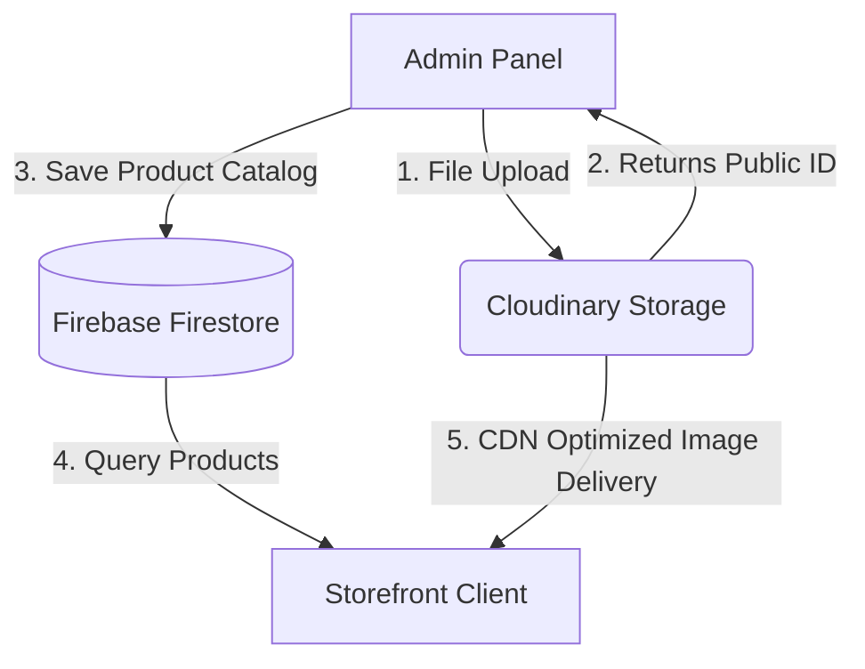

# Sai Trends — Made for Modern Men

Sai Trends is an elegant, premium e-commerce catalog store tailored for modern men's fashion. The website features responsive designs, dynamic theme switching (Light/Dark mode), real-time cloud database synchronization, and automated high-performance image optimization.

---

## 🛠️ Technology Stack

* **Frontend Framework**: [React 19](https://react.dev/) + [Vite](https://vite.dev/) (for fast build times and HMR)
* **Styling**: [Tailwind CSS v4](https://tailwindcss.com/) (utility-first modern CSS compiler)
* **Database Layer**: [Firebase Cloud Firestore](https://firebase.google.com/docs/firestore) (real-time cloud database storage)
* **Image Cloud & Optimization**: [Cloudinary](https://cloudinary.com/) (dynamic image transformations, uploads, and CDN delivery)
* **Hosting & Deployment**: [Vercel](https://vercel.com/) (continuous deployment integrated with GitHub)

---

## 🔄 How the Website Works (Data Flow)



### 1. The Cloud Database Connection (Firestore)
* The application initializes the Firebase SDK using environment variables. 
* It checks if Firestore is connected. If yes, it queries the `products` and `settings/lookbook` collections dynamically. 
* If there is no network connection or database configuration, it automatically switches to a **LocalStorage fallback mode** to keep the storefront functional.

### 2. The Direct Image Uploader (Cloudinary)
* Inside the Admin Panel, administrators can either paste an image URL or click **📤 Upload** to select a file from their local computer.
* Selecting a file sends an asynchronous `POST` request directly to the Cloudinary upload API.
* Upon success, Cloudinary returns the `public_id` of the image, which automatically fills the form text field.

### 3. Displaying and Transforming Images
* Products are rendered using the custom `CloudinaryImage` component.
* If the image property is a Cloudinary `public_id` (e.g. `cld-sample-5`), the component uses the `@cloudinary/url-gen` SDK to request:
  * **Auto-format & Auto-quality**: Delivers the best modern format (WebP/AVIF) and quality compression based on the user's browser.
  * **Smart Aspect Crops**: Crops the catalog items dynamically to a clean `3:4` aspect ratio centered on the image gravity focus.
* If the image is a standard web link, it falls back to a standard `` tag with lazy loading enabled.

---

## 🚀 Step-by-Step Setup Guide

### Step 1: Install Dependencies
Clone the repository and install the packages:
```bash
npm install
```

### Step 2: Configure Environment Variables (`.env.local`)
Create a `.env.local` file in the root directory and add your private credentials:
```env
# Firebase Client Credentials
VITE_FIREBASE_API_KEY=your_firebase_api_key
VITE_FIREBASE_AUTH_DOMAIN=your_project_id.firebaseapp.com
VITE_FIREBASE_PROJECT_ID=your_project_id
VITE_FIREBASE_STORAGE_BUCKET=your_project_id.firebasestorage.app
VITE_FIREBASE_MESSAGING_SENDER_ID=your_sender_id
VITE_FIREBASE_APP_ID=your_app_id
VITE_FIREBASE_MEASUREMENT_ID=your_measurement_id

# Cloudinary Credentials
VITE_CLOUDINARY_CLOUD_NAME=your_cloud_name
VITE_CLOUDINARY_API_KEY=your_cloudinary_api_key
VITE_CLOUDINARY_UPLOAD_PRESET=your_unsigned_preset_name
```

### Step 3: Configure Cloud Firestore (Firebase Console)
Since the app performs database operations client-side, set your **Firestore Security Rules** under the **Rules** tab in the Firebase Console:
```javascript
rules_version = '2';
service cloud.firestore {
  match /databases/{database}/documents {
    match /products/{document} {
      allow read, write: if true;
    }
    match /settings/{document} {
      allow read, write: if true;
    }
  }
}
```

### Step 4: Setup Cloudinary Unsigned Upload Preset
1. Go to **Cloudinary Settings** ➔ **Upload** tab.
2. Under **Upload presets**, click **Add upload preset**.
3. Set the **Signing Mode** to **Unsigned**.
4. Set the name of the preset (e.g., `SAI_TRENDZZ`) and save it. Make sure this name matches `VITE_CLOUDINARY_UPLOAD_PRESET` in your `.env.local` file.

### Step 5: Add Variables on Vercel
1. Go to your Vercel Project dashboard ➔ **Settings** ➔ **Environment Variables**.
2. Add the 10 variables from your `.env.local` file.
3. Trigger a **Redeploy** on Vercel to load the environment variables into the live build.

---

## 💻 Running the Project Locally

* **Run Dev Server**:
  ```bash
  npm run dev
  ```
  *(Opens local server at `http://localhost:5173/`)*

* **Build for Production**:
  ```bash
  npm run build
  ```

* **Deploy Updates**:
  ```bash
  git add .
  git commit -m "commit message"
  git push
  ```
  *(Triggers automatic CI/CD deployment on Vercel)*
